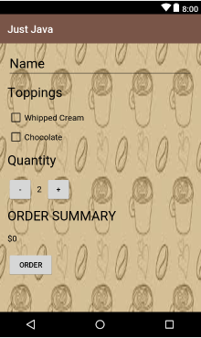

# coffeeorderapp
This app is made for udacity android scholarship 2018 ,this is a coffee ordering app user can order coffee of desired quantity and toppings and the order summary is sent through mail and even i have made the localization of app and now the app is compatible to translate itself in spanish language.
Now what is localization ,that is ablity of the app to translate itself to other languages except english like arabic,spanish etc.

